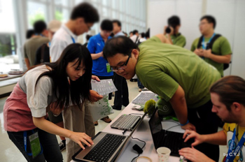

# About COSCUP

It is a common fact that coders from traditional commercial software rarely interact with users.

Is there a trouble on your software? Call the telephone support service, our technicians may help you. Hard as they tried, your problem still remains. If it is caused by a bug, the only solution is to wait until the new version releases. The only reason why you have chosen software A instead of B, is probably because of the sales' branin-washing or your friends' recommandation. Under this behavior pattern, users and coders confront with sales and customers service, while what users encounter can't be passed on directly, and your real question travels a long journey to get the right person.

The term "Open Source" appears in 1998, which is familiar to everyone. This kind of developing pattern working Internet over 20 to 30 years, attributes to many reasons. The key factor may be the direct interaction with coders and users, which forms a rapid feedback and patch system on bugs. This pattern is enlarged by Network, where Linus's law "With enough eyeballs, all bugs are shallow" occurs, thereby the software's quality enhances. In Open Source pattern, promoters take the position between coders and users, rather than sales and customer service. They package software suites to get installation easier, write documents to lower down its learning curve, hold events to spread good software, solve questions from the Internet without creating information asymmetric to coders.

This conference is organized for three kinds of roles that makes Open Source Software sparkle. They are coders, promoters, and users. You might be a coder from Software A, a promoter from Software B, and an user from Software C. No matter you have already stepped into the field of Open Source, or even standing on the gate wandering, we welcome you to attand the annual biggest Conference for Open Source Coders, Users, and Promoters in Taiwan!

COSCUP celebrated its 9th anniversary this year. Over the past 8 years, the event has co-operated with coumminities all over the world. With everyone's involvement, we grow sustainly. Whoever you are a Open Source coder, a devoted Open Source promoter, a user fimiliar with Open Source, or even a newbie, we sincerely welcome you to be a part of COSCUP.

## 2014 Organizing Team

### Organizer

**[BobChao](https://reps.mozilla.org/u/bobchao/)**（Mozilla Community）

### Session Convener

Leader: **cclien**

- AL - 小卓
- Danny
- Jenny (jsliang)
- Mosky
- Richard 強哥
- 大眼
- 義鴻

### Sales

Leader: **蝦蝦shiashia**

- Ernest (dwchiang)
- Paddy
- 糖果荔枝

### Marketing

Leader: **Muka**

- #Chiakai
- pingooo
- RSChiang
- Singing
- Violet 阿紫
- 凍仁翔
- 雁子

### PR

Leader: **仁豪**

### Field Service

Leader: **MouseMs**

- Aleck陳經理
- Angelboy
- CCKai
- Clarence
- Eason
- Egret
- Ei-ling 艾岭
- Elvis
- Emma
- Fish福
- FrankWu
- frankye
- Henry Lee
- Kevin
- Kevin-WY
- Kiki
- lin4h
- Lulu
- Marsen
- NaNi
- Rifur
- RJ
- sanyuan
- SONY
- Stanley
- swem 蕭辰翰
- Teresa
- Trista
- Vagabond
- Vincent
- Wei
- wenhao
- ws育慈
- Yexina
- φ (Phi)
- 下午
- 亞亞
- 伊賀
- 匡政
- 姿姿
- 小Q
- 小元
- 小六
- 小宇
- 小方
- 小馬
- 崑元
- 平原不是丘陵
- 幻幽
- 影子
- 政哲
- 敬育
- Yuna
- 欣哥
- 洋蔥
- 白白的莫風
- 立揚
- 糖萱
- 紗子
- 花花
- 阿膽
- 高個
- 魏言
- 魚魚
- 麵包

### Network Service

Leader: **David Huang**

- Conan
- cyrandy
- DennyHuang
- Ei-ling 艾岭
- HenryYang
- itsneo
- Ming
- Nalant
- Peter
- Sars
- sntc06
- Starlition
- xxx
- 凌羽
- 小六
- 小明
- 小翊
- 左邊
- 手慢君
- 波卡Poka
- 浚原
- 皇甫
- 竹本立里
- 胖胖
- 腹黒い茶
- 阿嘉

### Archiving Team

Leader: **丞相**

- adaam
- Aminzai
- Arvin
- Can
- CJOKER
- Daniel丹丹
- Iven
- Mike
- Stanley
- w
- Zac
- 傑諾特
- 勞倫斯
- 小聖
- 小豪
- 日京三子
- 星雨
- 歐三
- 西歪街
- 黃牙牙

### Accountant

Leader: **Tim Chen**

- Toby Liu
- Singing

### Cashier

Leader: **Lloyd Huang**

### Administration Assistant

Leader: **小畢 (CrBoy)**

- choupi
- Idril*阿南
- Jie
- nfsnfs
- Orange
- Rainny
- Yiling Chen
- 一枝
- 奇猴
- 小草
- 豬豬
- 闇鴉/Lora

### Website

- Evelyn Hung
- Kanru

