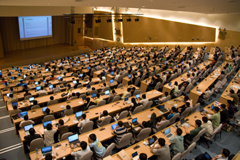

# 关于活动

传统商业软件的程序开发者 (coders) 和用戶 (users) 很少交流，是大家都接受的事实。

你的软件用起来有问题？请打技术支持电话，由客服人员为你服务，他或许已经尽其所能，但未必能解决你的问题。如果问题是软件的臭虫，你只好痴痴地等待不知几年后才开卖的下一版。而你当初之所以选用Ａ软件而不是Ｂ软件，常常是听信销售员 (sales) 的一面之词或同侪的推荐。在这个行为模式下，用戶面对的是销售员和客服，程序員面对的还是销售员和客服，用戶遇到的问题要间接地才能反应到开发者手上，中间还可能会被过滤掉。

開放源碼这个在 1998 年出现的名词，大家早已耳熟能详。这种在网络上已经进行二、三十年的软件开发模式之所以能成功，有许多原因。其中一个极为关键的因素，就是 coder 与 user 的直接接触。无屏障的交流形成了问题的快速回报和修补机制，而当这个机制被网络效应放大到极限时，Linus 定律就出现了：「臭虫难逃众人法眼」 (With enough eyeballs, all bugs are shallow)，软件质量因此显着提升。在 open source 的模式中，coders 和 users 中间的人不再是销售员或客服，而是让软件更容易被 users 接受的推广者 (promoters)，他们打包套件让软件更好装、写说明文件让软件更易学、办推广活动让更多人接触到好软件、在网络上回答问题解决使用者的疑惑，而且不会把 coders 藏在背后产生信息的不对称。

Coders、users 和 promoters 是让 open source 软件发光发热的三大支柱，这个研讨会就是专为这三种人举办的：你可以是 A 软件的 coder、B 软件的 promoter、C 软件的 user，不论你是已经踏入 open source 领域，还是一直站在门口不知如何入门，欢迎你来参加 COSCUP — Conference for Open Source Coders, Users and Promoters! 

COSCUP 研讨会已堂堂迈入第九年，八年来不但由各地社群共同举办，在众多同好的参与之下，逐渐成长茁壮。无论你是写 open source 软件的开发者、热衷 open source 软件的推广者、熟悉 open source 软件的用户或是想了解 open source 软件的新手，都欢迎你来参加一年一度全台最大的开源人年会。

## 2014 筹备团队

### 总召集人

 **[BobChao](https://reps.mozilla.org/u/bobchao/)**（Mozilla Community）

### 议程

组长： **cclien**

- AL - 小卓
- Danny
- Jenny
- Mosky
- Richard 強哥
- 大眼
- 義鴻

### 销售

组长： **蝦蝦shiashia**

- Ernest (dwchiang)
- Paddy
- 糖果荔枝

### 行销

组长： **Muka**

- #Chiakai
- pingooo
- RSChiang
- Singing
- Violet 阿紫
- 凍仁翔
- 雁子

### 公关

组长： **仁豪**

### 场务

组长： **MouseMs**

- Aleck陳經理
- Angelboy
- CCKai
- Clarence
- Eason
- Egret
- Ei-ling 艾岭
- Elvis
- Emma
- Fish福
- FrankWu
- frankye
- Henry Lee
- Kevin
- Kevin-WY
- Kiki
- lin4h
- Lulu
- Marsen
- NaNi
- Rifur
- RJ
- sanyuan
- SONY
- Stanley
- swem 蕭辰翰
- Teresa
- Trista
- Vagabond
- Vincent
- wenhao
- ws育慈
- Yexina
- φ (Phi)
- 下午
- 亞亞
- 伊賀
- 姿姿
- 小元
- 小六
- 小宇
- 小方
- 小馬
- 崑元
- 平原不是丘陵
- 幻幽
- 影子
- 政哲
- 敬育
- 日京三子
- 欣哥
- 洋蔥
- 白白的莫風
- 立揚
- 糖萱
- 紗子
- 花花
- 負負
- 阿膽
- 高個
- 魏言
- 魚魚
- 麵包

### 线路

组长： **David Huang**

- Conan
- cyrandy
- 薏仁
- DennyHuang
- HenryYang
- itsneo
- Ming
- Nalant
- Peter
- Sars
- sntc06
- Starlition
- xxx
- 凌羽
- 小明
- 浚原
- 竹本立里
- 胖胖
- 腹黒い茶
- 阿嘉

### 记录

组长： **丞相**

- adaam
- Aminzai
- CJOKER
- Iven
- Mike
- Stanley
- w
- 傑諾特
- 小聖
- 小豪
- 星雨
- 歐三
- 黃牙牙

### 会计

组长： **Tim Chen**

- Toby Liu
- Singing Li

### 出纳

组长： **Lloyd Huang**

### 行政

组长： **小畢 (CrBoy)**

- choupi
- Idril*阿南
- Rainny
- 奇猴
- 小草
- 闇鴉/Lora

### 网站

- Evelyn Hung
- Kanru

